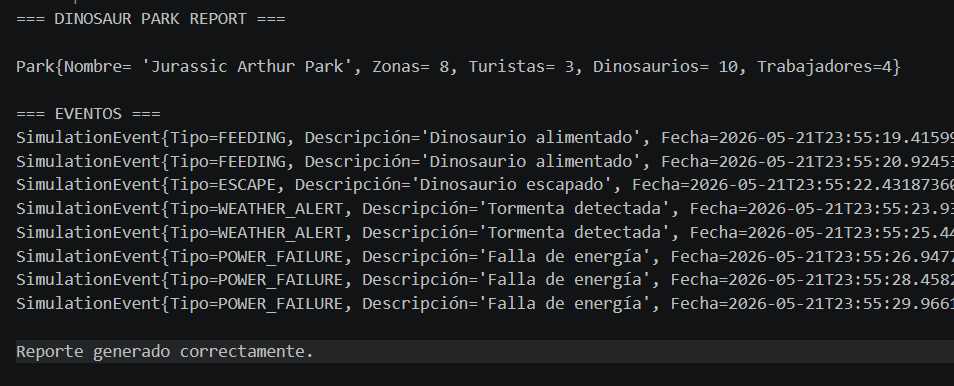
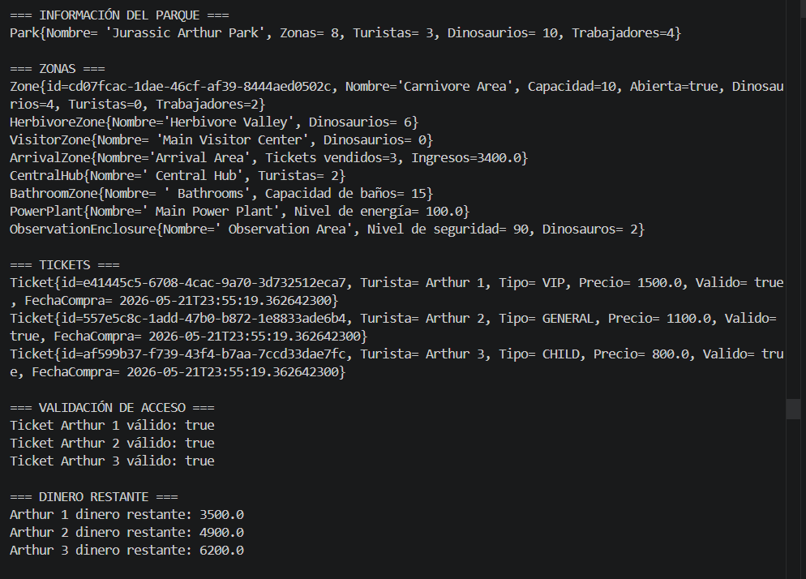

# Dinosaur Park Simulation The Arthur 
# (B09_Arturo Perez Gomez)

Proyecto de simulación de parque de dinosaurios desarrollado en Java con Maven.

## Tecnologías

- Java
- Maven
- JUnit 5
- Mockito
- Jacoco

## Ejecutar proyecto

```bash
mvn clean compile
mvn exec:java
````

## Ejecutar pruebas

```bash
mvn test

## Resultados:



